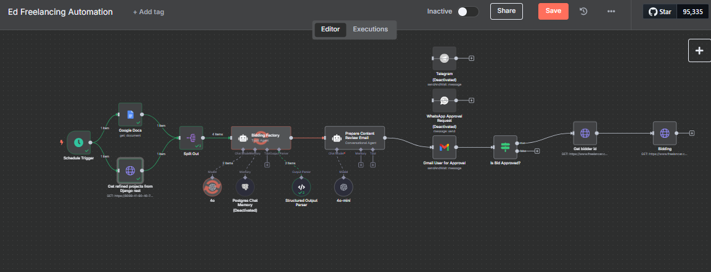

# 🤖 AI-Powered Auto-Bidding System for Freelancers

This project automates the process of identifying freelance jobs, generating personalized bid proposals using OpenAI, and submitting them after human approval. Built to streamline my freelance workflow, it combines Django, n8n, and GPT-4 to act as an intelligent assistant that *works while I sleep*.

---

## 🔍 Project Overview

- **Django REST API** fetches and filters projects from [Freelancer.com](https://freelancer.com) Developer API
- **n8n Workflow Automation**:
  - Periodically retrieves projects
  - Uses GPT-4 to generate concise proposals (2-paragraph max)
  - Sends proposals via Telegram or Gmail for approval
- **Human-in-the-Loop (HITL)**: Review or edit the proposal before final submission
- **Future Goal**: Make it extensible for use by small agencies and freelance teams

---

## 🧰 Tech Stack

- **Backend**: Django, Django REST Framework
- **Automation Engine**: n8n
- **AI Engine**: OpenAI GPT-4 (via API)
- **Communication**: Gmail API, Telegram Bot API
- **Project Source**: Freelancer.com Developer API
- **File Access**: Google Drive API (for referencing CV)

---

## ✨ Features

- Smart filtering (based on bid count, project age, keywords)
- Fully automated bid drafting via OpenAI
- Editable and reviewable via Telegram or Gmail
- Scalability-ready architecture using Django (vs Flask/FastAPI)
- Professional CV content embedded for context-aware bids

---

## 🧑‍💼 Use Case

This was built for my personal freelance operations to save time while increasing proposal quality. With HITL in place, it maintains authenticity while reducing repetitive tasks.

**Portfolio:** [eddiemuhoro.vercel.app](https://eddiemuhoro.vercel.app)  
**GitHub:** [github.com/eddiemuhoro](https://github.com/eddiemuhoro)

---

## 📌 Future Enhancements

- Admin dashboard to manage bid history and logs
- Multi-platform integration (Upwork, PeoplePerHour, etc.)
- Dynamic prompt optimization using past proposal performance
- Agency/team-based support with role permissions

---

**📊 Workflow Overview**
> Workflow diagrams, sample Telegram approval flow, and Django admin panel

---

## 🔐 License

MIT License — use, fork, or contribute freely.

